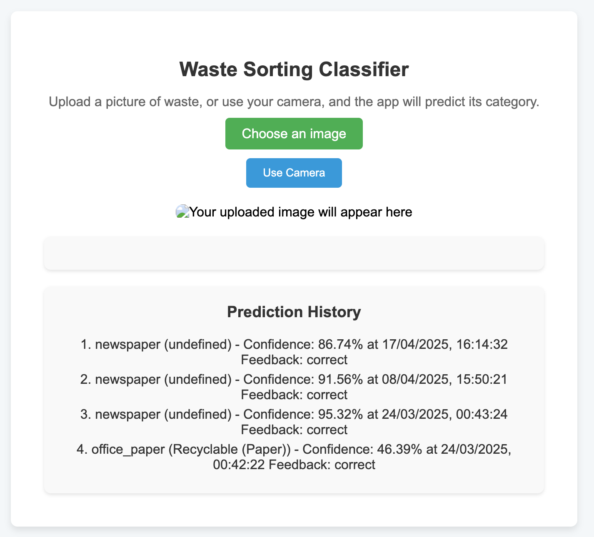
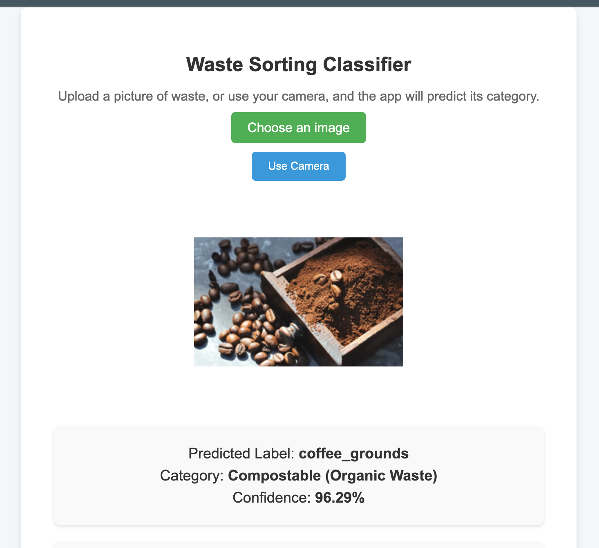
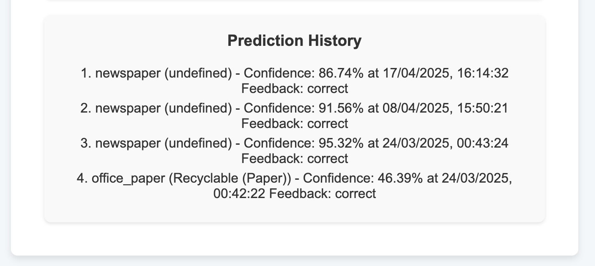

# Waste Sorting Classifier

## Overview

The **Waste Sorting Classifier** is an AI-powered web application designed to help users identify and categorize waste items for proper disposal. Using a machine learning model trained on 15,000 images with Lobe, the app classifies waste into categories such as Recyclable, Compostable, or Landfill. The app supports both image uploads and real-time camera input, stores predictions in a MongoDB database, and allows users to provide feedback on predictions.

This project demonstrates skills in AI/ML (image classification with TensorFlow.js), full-stack development (Node.js, Express, MongoDB), and web development (HTML, CSS, JavaScript). It’s a practical application with a focus on environmental impact, making it a valuable addition to my portfolio for remote AI/ML job or internship applications in 2025.

## Features

- **Image Classification**: Upload an image or use your device’s camera to classify waste items into 30 categories (e.g., plastic bottles, food waste, styrofoam cups).
- **Real-Time Camera Support**: Take a photo directly from your device with a countdown timer for better user experience.
- **Prediction History**: View past predictions stored in a MongoDB database, with the ability to provide feedback (e.g., mark predictions as “correct” or “incorrect”).
- **User-Friendly Interface**: Clean and responsive design, tested on multiple devices (laptops, smartphones, tablets).
- **Backend Integration**: A Node.js/Express backend saves predictions and feedback to MongoDB, enabling data persistence and future_net model improvements.

## Screenshots

### Main Interface

*Upload an image or use the camera to classify waste.*



### Prediction Result

*View the predicted label, category, and confidence score.*



### Prediction History

*See past predictions and provide feedback.*



## Technologies Used

- **Frontend**:
  - HTML, CSS, JavaScript
  - TensorFlow.js for running the machine learning model in the browser
- **Backend**:
  - Node.js and Express for the server
  - MongoDB (via MongoDB Atlas) for data storage
- **Machine Learning**:
  - Lobe for training the image classification model on a dataset of 15,000 images
  - TensorFlow.js for model inference
- **Deployment**:
  - Frontend hosted on [GitHub Pages/Netlify] (update with your deployment platform)
  - Backend deployed on [Heroku/Render] (update with your deployment platform)

## Setup Instructions

### Prerequisites

- Node.js and npm installed ([download here](https://nodejs.org))
- MongoDB Atlas account ([sign up here](https://www.mongodb.com))
- A browser with camera support for testing the camera feature

### Installation

1. **Clone the Repository**:

   ```bash
   git clone https://github.com/your-username/waste-sorting-app.git
   cd waste-sorting-app

2. **Set Up the Backend**:
- Navigate to the backend folder:
   ```bash
   
   cd backend
- Install dependencies:
     ```bash
     npm install

- Create a .env file in the backend folder and add your MongoDB connection string:
  ```bash
  MONGODB_URI=mongodb+srv://<username>:<password>@cluster0.mongodb.net/waste-sorting-app?retryWrites=true&w=majority PORT=5000

- Start the backend server:
    ```bash
    node server.js

3. **Set Up the Frontend**:
- In the root directory, install a simple server to serve the frontend (e.g., http-server):
    ```bash
    npm install -g http-server

- Start the frontend server:
   ```bash
    http-server -p 8080

- Open your browser and go to http://localhost:8080.


4. **Update the Backend URL**:
- In app.js, ensure the BACKEND_URL matches your backend’s URL (default: http://localhost:5000).

### Model Setup
- The machine learning model (model.json) is located in the model folder. It was trained using Lobe on a dataset of 15,000 images across 30 waste categories.
- Ensure the model files are present in the model folder before running the app.

## Usage

1. Open the app in your browser (`http://localhost:8080`).
2. Upload an image of a waste item or click “Use Camera” to take a photo.
3. Wait for the prediction, which will display the waste item’s label, category (e.g., Recyclable, Compostable, Landfill), and confidence score.
4. View past predictions in the “Prediction History” section and provide feedback by marking predictions as “correct” or “incorrect”.

## Challenges and Solutions

- **Camera Support**: Integrated camera functionality using `navigator.mediaDevices.getUserMedia`, with a countdown timer for better UX. Tested on multiple devices to ensure compatibility.
- **Backend Integration**: Initially faced issues with predictions not saving to MongoDB due to a database name mismatch (`waste-sorting` vs. `waste-sorting-app`). Resolved by updating the `MONGODB_URI` in the backend.
- **Responsive Design**: Ensured the app works seamlessly on mobile devices by using responsive CSS and testing on smartphones and tablets.

## Future Improvements

- **Multi-Item Detection**: Upgrade the model to support object detection (e.g., using YOLOv5) to identify multiple waste items in a single image.
- **Model Accuracy**: Collect user feedback to retrain the model and improve accuracy for misclassified items.
- **Environmental Impact**: Add a section to show the environmental impact of proper waste sorting (e.g., CO2 savings from recycling).
- **Real-Time Feedback**: Allow users to submit feedback directly to improve the model in real-time via a backend API.

## License

This project is licensed under the MIT License - see the [LICENSE](LICENSE) file for details.

## Contact

For questions or collaboration, feel free to reach out:

- GitHub: https://github.com/engr-muhammadzakria
- Email: mzakira7599@gmail.com
